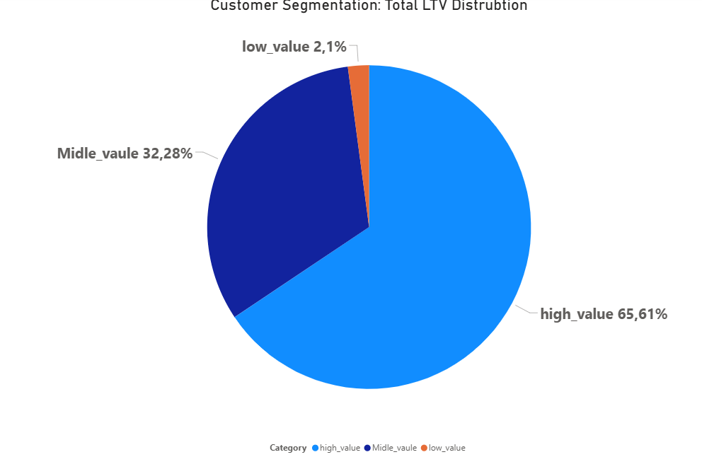
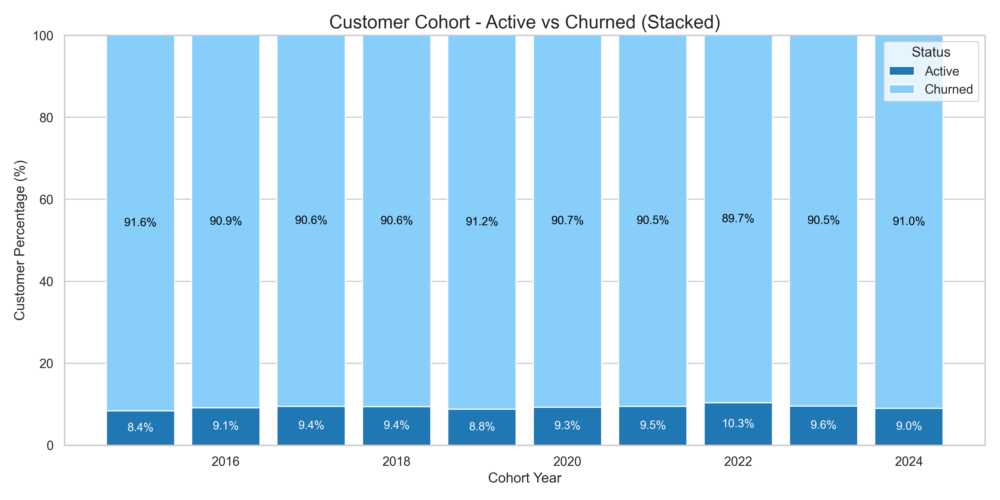
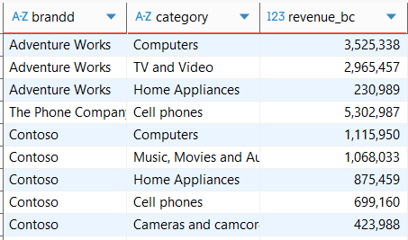

# sql project

## Overview
here you can see some of my work while learning sql (basic and Intermediate level)

## Business Questions
1. **Customer Segmentation:** Who are our most valuable customers?
2. **Cohort Analysis:** How do different customer groups generate revenue?
3. **Retention Analysis:** Which customers haven't purchased recently?
4. **top_brands.sql:** top 5 categories according to the top 3 brands in 2023

## views
**🖥️ Query**: [create_views](views.sql)
here you can see the reviews I created during projects and later referenced them

## Analysis

### 1. Customer Segmentation
**🖥️ Query**: [1__customer_segmentation](1_customer_segment.sql)
- Categorized customers based on total lifetime value (LTV)
- Assigned customers to High, Mid, and Low-value segments
- Calculated key metrics like total revenue

**📈 Visualization:**

 📊 **Key Findings:**
- High-value segment (25% of customers) drives 66% of revenue ($135.4M)
- Mid-value segment (50% of customers) generates 32% of revenue ($66.6M)
- Low-value segment (25% of customers) accounts for 2% of revenue ($4.3M)

💡 **Business Insights**
- High-Value (66% revenue): Offer premium membership program to 12,372 VIP customers, as losing one customer significantly impacts revenue
- Mid-Value (32% revenue): Create upgrade paths through personalized promotions, with potential $66.6M → $135.4M revenue opportunity
- Low-Value (2% revenue): Design re-engagement campaigns and price-sensitive promotions to increase purchase frequency

### 2. Customer Revenue by Cohort
**🖥️ Query**: [2_cohort_analysies](2_cohort_analysies.sql)
- Tracked revenue and customer count per cohorts
- Cohorts were grouped by year of first purchase
- Analyzed customer revenue at a cohort level

**📈 Visualization:**

> ⚠️ Note: This only includes 2 charts. 

Customer Revenue by Cohort (Adjusted for time in market) - First Purchase Date

Investigate Monthly Revenue & Customer Trends (3 Month Rolling Average)

📊 **Key Findings:**  
- Customer revenue is declining, older cohorts (2016-2018) spent ~$2,800+, while 2024 cohort spending dropped to ~$1,970.  
- Revenue and customers peaked in 2022-2023, but both are now trending downward in 2024.  
- High volatility in revenue and customer count, with sharp drops in 2020 and 2024, signaling retention challenges.  

💡 **Business Insights:**  
- Boost retention & re-engagement by targeting recent cohorts (2022-2024) with personalized offers to prevent churn.  
- Stabilize revenue fluctuations and introduce loyalty programs or subscriptions to ensure consistent spending.  
- Investigate cohort differences by applying successful strategies from high-spending cohorts (2016-2018) to newer ones.

### 3. Customer Retention
🖥️ Query: [3_retention_analysis](3_customer_retention.sql)

- Identified customers at risk of churning
- Analyzed last purchase patterns
- Calculated customer-specific metrics

**📈 Visualization:**

📊 **Key Findings:**  
- Cohort churn stabilizes at ~90% after 2-3 years, indicating a predictable long-term retention pattern.  
- Retention rates are consistently low (8-10%) across all cohorts, suggesting retention issues are systemic rather than specific to certain years.  
- Newer cohorts (2022-2023) show similar churn trajectories, signaling that without intervention, future cohorts will follow the same pattern.  

💡 **Business Insights:**  
- Strengthen early engagement strategies to target the first 1-2 years with onboarding incentives, loyalty rewards, and personalized offers to improve long-term retention.  
- Re-engage high-value churned customers by focusing on targeted win-back campaigns rather than broad retention efforts, as reactivating valuable users may yield higher ROI.  
- Predict & preempt churn risk and use customer-specific warning indicators to proactively intervene with at-risk users before they lapse.

### 3. Customer Retention
🖥️ Query: [top_3_brands](4_top_brands.sql)

- 3 most profitable brands found
- Found the 5 most profitable categories according to brand
- Automated search for the best brand for a certain period

**📈 Visualization:** 

(p.s. There was a certain unexpected problem related to the fact that I didn't think that there wouldn't be 5 product categories for each of the best brands. But I decided to leave the code itself and its result (I no longer visualized 3 separate brands of the category, because it would not look ethnic:( )

## Technical Details
- **Database:** PostgreSQL
- **Analysis Tools:** PostgreSQL, Dbeaver
- **Visualization:** ChatGPT, Power BI, Python(matplotlib)
